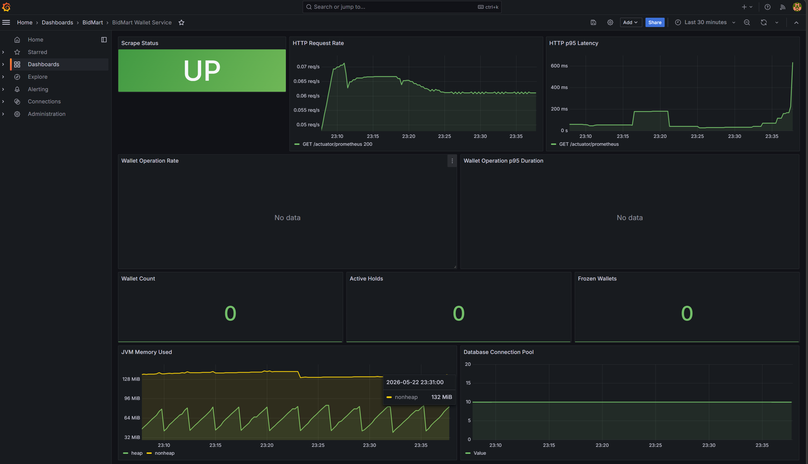

# BidMart Wallet Service

Wallet service menangani saldo user, top up, withdraw, hold saldo saat bidding,
release/capture hold, settlement auction, dan audit transaksi wallet.

## Monitoring

Monitoring wallet-service memakai:

- Spring Boot Actuator untuk health check dan endpoint metrics.
- Micrometer Prometheus registry untuk expose metrics di `/actuator/prometheus`.
- Prometheus untuk scrape metrics wallet-service.
- Grafana untuk dashboard visual.
- Custom wallet metrics untuk operasi bisnis wallet.

Endpoint monitoring:

| Endpoint | Fungsi |
| --- | --- |
| `GET /actuator/health` | Health check service. |
| `GET /actuator/prometheus` | Metrics Prometheus. |

Custom metrics utama:

| Metric | Arti |
| --- | --- |
| `wallet_operation_total` | Total operasi wallet berdasarkan `operation`, `outcome`, dan `exception`. |
| `wallet_operation_duration_seconds` | Durasi operasi wallet, bisa dipakai untuk p95 latency. |
| `wallet_wallets` | Jumlah wallet di database. |
| `wallet_wallets_frozen` | Jumlah wallet yang dibekukan. |
| `wallet_holds_active` | Jumlah hold saldo aktif. |

Selain itu, Actuator juga expose metrics bawaan seperti `http_server_requests_seconds`,
`jvm_memory_used_bytes`, `hikaricp_connections`, dan `spring_kafka_listener_seconds`.
